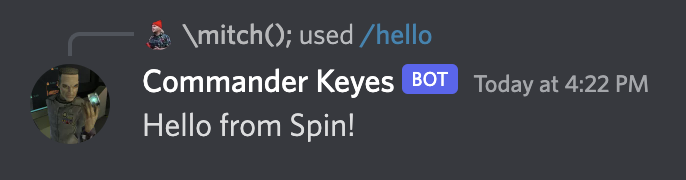

# A Discord Bot written with Spin

## Setup:

1. Create a bot
1. Get an OAuth2 URL and have `applications.commands` enabled in scope
1. Copy the bot token + public key to `spin.toml`
1. Install [just](https://github.com/casey/just)
1. `just spin-up`
1. `ngrok http 3000`
1. Add `https://[...id].ngrok.io/api/interactions` under "Interactions Endpoint URL"
1. Try `/hello` in your server

## To Do:

- [ ] Parameterize env variables via .env
- [ ] Find a crate that can be used for types
- [ ] Make a more ergonomic framework for creating commands and replying to
      interactions
